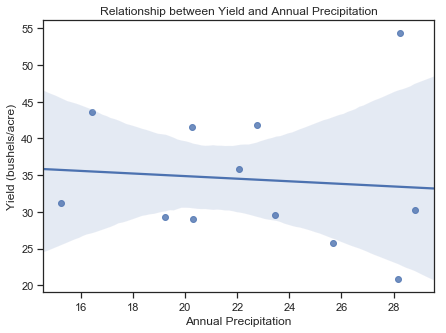

# BarleyYields
Exploratory Data Analysis in Python using data from a study of Barley Yields in Minnesota. 
Seaborn is used for visualizations.

```python
# import libraries
import pandas as pd
import numpy as np
import seaborn as sns
import matplotlib.pyplot as plt
%matplotlib inline
```


```python
# import the data
data = pd.read_csv('data.csv')

# look at the first few rows
data.head()
```


<div>
<style scoped>
    .dataframe tbody tr th:only-of-type {
        vertical-align: middle;
    }

    .dataframe tbody tr th {
        vertical-align: top;
    }

    .dataframe thead th {
        text-align: right;
    }
</style>
<table border="1" class="dataframe">
  <thead>
    <tr style="text-align: right;">
      <th></th>
      <th>id</th>
      <th>yield</th>
      <th>variety</th>
      <th>year</th>
      <th>site</th>
    </tr>
  </thead>
  <tbody>
    <tr>
      <th>0</th>
      <td>71</td>
      <td>14.43333</td>
      <td>Glabron</td>
      <td>1932</td>
      <td>Grand Rapids</td>
    </tr>
    <tr>
      <th>1</th>
      <td>113</td>
      <td>15.23333</td>
      <td>No. 475</td>
      <td>1932</td>
      <td>Grand Rapids</td>
    </tr>
    <tr>
      <th>2</th>
      <td>77</td>
      <td>16.63333</td>
      <td>Svansota</td>
      <td>1932</td>
      <td>Grand Rapids</td>
    </tr>
    <tr>
      <th>3</th>
      <td>95</td>
      <td>19.46667</td>
      <td>No. 457</td>
      <td>1932</td>
      <td>Grand Rapids</td>
    </tr>
    <tr>
      <th>4</th>
      <td>53</td>
      <td>19.70000</td>
      <td>No. 475</td>
      <td>1931</td>
      <td>Grand Rapids</td>
    </tr>
  </tbody>
</table>
</div>


```python
# data type for each column
data.dtypes
```


    id           int64
    yield      float64
    variety     object
    year         int64
    site        object
    dtype: object


```python
# count number of unique values in each column
data.nunique()
```


    id         120
    yield      114
    variety     10
    year         2
    site         6
    dtype: int64


```python
# pivot table to show average yield in each year
year = pd.pivot_table(data, values = 'yield', index = ['year'],  aggfunc=np.mean)
year.round(2)
```


<div>
<style scoped>
    .dataframe tbody tr th:only-of-type {
        vertical-align: middle;
    }

    .dataframe tbody tr th {
        vertical-align: top;
    }

    .dataframe thead th {
        text-align: right;
    }
</style>
<table border="1" class="dataframe">
  <thead>
    <tr style="text-align: right;">
      <th></th>
      <th>yield</th>
    </tr>
    <tr>
      <th>year</th>
      <th></th>
    </tr>
  </thead>
  <tbody>
    <tr>
      <th>1931</th>
      <td>37.08</td>
    </tr>
    <tr>
      <th>1932</th>
      <td>31.76</td>
    </tr>
  </tbody>
</table>
</div>


```python
# pivot table to show average yield in each year by variety
variety = pd.pivot_table(data, values = 'yield', index = ['variety'], columns = 'year',  aggfunc=np.mean)
variety.round(2)
```


<div>
<style scoped>
    .dataframe tbody tr th:only-of-type {
        vertical-align: middle;
    }

    .dataframe tbody tr th {
        vertical-align: top;
    }

    .dataframe thead th {
        text-align: right;
    }
</style>
<table border="1" class="dataframe">
  <thead>
    <tr style="text-align: right;">
      <th>year</th>
      <th>1931</th>
      <th>1932</th>
    </tr>
    <tr>
      <th>variety</th>
      <th></th>
      <th></th>
    </tr>
  </thead>
  <tbody>
    <tr>
      <th>Glabron</th>
      <td>37.33</td>
      <td>29.36</td>
    </tr>
    <tr>
      <th>Manchuria</th>
      <td>34.19</td>
      <td>28.73</td>
    </tr>
    <tr>
      <th>No. 457</th>
      <td>40.25</td>
      <td>31.44</td>
    </tr>
    <tr>
      <th>No. 462</th>
      <td>39.06</td>
      <td>31.70</td>
    </tr>
    <tr>
      <th>No. 475</th>
      <td>31.82</td>
      <td>31.71</td>
    </tr>
    <tr>
      <th>Peatland</th>
      <td>36.58</td>
      <td>31.78</td>
    </tr>
    <tr>
      <th>Svansota</th>
      <td>34.01</td>
      <td>26.74</td>
    </tr>
    <tr>
      <th>Trebi</th>
      <td>42.47</td>
      <td>36.33</td>
    </tr>
    <tr>
      <th>Velvet</th>
      <td>34.49</td>
      <td>31.63</td>
    </tr>
    <tr>
      <th>Wisconsin No. 38</th>
      <td>40.58</td>
      <td>38.21</td>
    </tr>
  </tbody>
</table>
</div>


```python
# pivot table to show average yield in each year by site
site = pd.pivot_table(data, values = 'yield', index = ['site'], columns = 'year',  aggfunc=np.mean)
site.round(2)
```


<div>
<style scoped>
    .dataframe tbody tr th:only-of-type {
        vertical-align: middle;
    }

    .dataframe tbody tr th {
        vertical-align: top;
    }

    .dataframe thead th {
        text-align: right;
    }
</style>
<table border="1" class="dataframe">
  <thead>
    <tr style="text-align: right;">
      <th>year</th>
      <th>1931</th>
      <th>1932</th>
    </tr>
    <tr>
      <th>site</th>
      <th></th>
      <th></th>
    </tr>
  </thead>
  <tbody>
    <tr>
      <th>Crookston</th>
      <td>43.66</td>
      <td>31.18</td>
    </tr>
    <tr>
      <th>Duluth</th>
      <td>30.29</td>
      <td>25.70</td>
    </tr>
    <tr>
      <th>Grand Rapids</th>
      <td>29.05</td>
      <td>20.81</td>
    </tr>
    <tr>
      <th>Morris</th>
      <td>29.29</td>
      <td>41.51</td>
    </tr>
    <tr>
      <th>University Farm</th>
      <td>35.83</td>
      <td>29.51</td>
    </tr>
    <tr>
      <th>Waseca</th>
      <td>54.35</td>
      <td>41.87</td>
    </tr>
  </tbody>
</table>
</div>


```python
# pivot table to show average yield in each year by site & variety
sitevar = pd.pivot_table(data, values = 'yield', index = ['site','variety'], columns = 'year',  aggfunc=np.mean)
sitevar.round(2)
```


<div>
<style scoped>
    .dataframe tbody tr th:only-of-type {
        vertical-align: middle;
    }

    .dataframe tbody tr th {
        vertical-align: top;
    }

    .dataframe thead th {
        text-align: right;
    }
</style>
<table border="1" class="dataframe">
  <thead>
    <tr style="text-align: right;">
      <th></th>
      <th>year</th>
      <th>1931</th>
      <th>1932</th>
    </tr>
    <tr>
      <th>site</th>
      <th>variety</th>
      <th></th>
      <th></th>
    </tr>
  </thead>
  <tbody>
    <tr>
      <th rowspan="10" valign="top">Crookston</th>
      <th>Glabron</th>
      <td>38.13</td>
      <td>26.17</td>
    </tr>
    <tr>
      <th>Manchuria</th>
      <td>39.93</td>
      <td>32.97</td>
    </tr>
    <tr>
      <th>No. 457</th>
      <td>45.67</td>
      <td>34.33</td>
    </tr>
    <tr>
      <th>No. 462</th>
      <td>48.57</td>
      <td>30.53</td>
    </tr>
    <tr>
      <th>No. 475</th>
      <td>44.10</td>
      <td>32.13</td>
    </tr>
    <tr>
      <th>Peatland</th>
      <td>41.60</td>
      <td>25.23</td>
    </tr>
    <tr>
      <th>Svansota</th>
      <td>40.47</td>
      <td>20.63</td>
    </tr>
    <tr>
      <th>Trebi</th>
      <td>46.93</td>
      <td>41.83</td>
    </tr>
    <tr>
      <th>Velvet</th>
      <td>41.33</td>
      <td>32.07</td>
    </tr>
    <tr>
      <th>Wisconsin No. 38</th>
      <td>49.87</td>
      <td>35.90</td>
    </tr>
    <tr>
      <th rowspan="10" valign="top">Duluth</th>
      <th>Glabron</th>
      <td>29.67</td>
      <td>25.87</td>
    </tr>
    <tr>
      <th>Manchuria</th>
      <td>28.97</td>
      <td>22.57</td>
    </tr>
    <tr>
      <th>No. 457</th>
      <td>33.60</td>
      <td>22.70</td>
    </tr>
    <tr>
      <th>No. 462</th>
      <td>28.10</td>
      <td>22.50</td>
    </tr>
    <tr>
      <th>No. 475</th>
      <td>33.07</td>
      <td>27.37</td>
    </tr>
    <tr>
      <th>Peatland</th>
      <td>32.00</td>
      <td>31.37</td>
    </tr>
    <tr>
      <th>Svansota</th>
      <td>25.70</td>
      <td>22.23</td>
    </tr>
    <tr>
      <th>Trebi</th>
      <td>33.93</td>
      <td>30.60</td>
    </tr>
    <tr>
      <th>Velvet</th>
      <td>26.30</td>
      <td>22.47</td>
    </tr>
    <tr>
      <th>Wisconsin No. 38</th>
      <td>31.60</td>
      <td>29.33</td>
    </tr>
    <tr>
      <th rowspan="10" valign="top">Grand Rapids</th>
      <th>Glabron</th>
      <td>29.13</td>
      <td>14.43</td>
    </tr>
    <tr>
      <th>Manchuria</th>
      <td>32.97</td>
      <td>22.13</td>
    </tr>
    <tr>
      <th>No. 457</th>
      <td>32.17</td>
      <td>19.47</td>
    </tr>
    <tr>
      <th>No. 462</th>
      <td>24.93</td>
      <td>19.90</td>
    </tr>
    <tr>
      <th>No. 475</th>
      <td>19.70</td>
      <td>15.23</td>
    </tr>
    <tr>
      <th>Peatland</th>
      <td>34.70</td>
      <td>26.77</td>
    </tr>
    <tr>
      <th>Svansota</th>
      <td>29.67</td>
      <td>16.63</td>
    </tr>
    <tr>
      <th>Trebi</th>
      <td>29.77</td>
      <td>20.63</td>
    </tr>
    <tr>
      <th>Velvet</th>
      <td>23.03</td>
      <td>32.23</td>
    </tr>
    <tr>
      <th>Wisconsin No. 38</th>
      <td>34.47</td>
      <td>20.67</td>
    </tr>
    <tr>
      <th rowspan="10" valign="top">Morris</th>
      <th>Glabron</th>
      <td>28.77</td>
      <td>35.13</td>
    </tr>
    <tr>
      <th>Manchuria</th>
      <td>27.43</td>
      <td>34.37</td>
    </tr>
    <tr>
      <th>No. 457</th>
      <td>28.70</td>
      <td>43.53</td>
    </tr>
    <tr>
      <th>No. 462</th>
      <td>30.37</td>
      <td>47.00</td>
    </tr>
    <tr>
      <th>No. 475</th>
      <td>22.60</td>
      <td>44.23</td>
    </tr>
    <tr>
      <th>Peatland</th>
      <td>29.87</td>
      <td>43.20</td>
    </tr>
    <tr>
      <th>Svansota</th>
      <td>25.77</td>
      <td>35.03</td>
    </tr>
    <tr>
      <th>Trebi</th>
      <td>43.77</td>
      <td>46.63</td>
    </tr>
    <tr>
      <th>Velvet</th>
      <td>26.13</td>
      <td>38.83</td>
    </tr>
    <tr>
      <th>Wisconsin No. 38</th>
      <td>29.47</td>
      <td>47.17</td>
    </tr>
    <tr>
      <th rowspan="10" valign="top">University Farm</th>
      <th>Glabron</th>
      <td>43.07</td>
      <td>36.80</td>
    </tr>
    <tr>
      <th>Manchuria</th>
      <td>27.00</td>
      <td>26.90</td>
    </tr>
    <tr>
      <th>No. 457</th>
      <td>43.27</td>
      <td>26.43</td>
    </tr>
    <tr>
      <th>No. 462</th>
      <td>36.60</td>
      <td>25.57</td>
    </tr>
    <tr>
      <th>No. 475</th>
      <td>24.67</td>
      <td>30.00</td>
    </tr>
    <tr>
      <th>Peatland</th>
      <td>32.77</td>
      <td>28.07</td>
    </tr>
    <tr>
      <th>Svansota</th>
      <td>35.13</td>
      <td>27.43</td>
    </tr>
    <tr>
      <th>Trebi</th>
      <td>36.57</td>
      <td>29.07</td>
    </tr>
    <tr>
      <th>Velvet</th>
      <td>39.90</td>
      <td>26.80</td>
    </tr>
    <tr>
      <th>Wisconsin No. 38</th>
      <td>39.30</td>
      <td>38.00</td>
    </tr>
    <tr>
      <th rowspan="10" valign="top">Waseca</th>
      <th>Glabron</th>
      <td>55.20</td>
      <td>37.73</td>
    </tr>
    <tr>
      <th>Manchuria</th>
      <td>48.87</td>
      <td>33.47</td>
    </tr>
    <tr>
      <th>No. 457</th>
      <td>58.10</td>
      <td>42.20</td>
    </tr>
    <tr>
      <th>No. 462</th>
      <td>65.77</td>
      <td>44.70</td>
    </tr>
    <tr>
      <th>No. 475</th>
      <td>46.77</td>
      <td>41.27</td>
    </tr>
    <tr>
      <th>Peatland</th>
      <td>48.57</td>
      <td>36.03</td>
    </tr>
    <tr>
      <th>Svansota</th>
      <td>47.33</td>
      <td>38.50</td>
    </tr>
    <tr>
      <th>Trebi</th>
      <td>63.83</td>
      <td>49.23</td>
    </tr>
    <tr>
      <th>Velvet</th>
      <td>50.23</td>
      <td>37.40</td>
    </tr>
    <tr>
      <th>Wisconsin No. 38</th>
      <td>58.80</td>
      <td>58.17</td>
    </tr>
  </tbody>
</table>
</div>


```python
# define the sort orders for plotting
year_order = np.sort(data.year.unique())
variety_order = np.sort(data.variety.unique())
site_order = np.sort(data.site.unique())
```


```python
# boxplot to show variation in yield by year
sns.set(rc={'figure.figsize':(8,7)})
sns.set(style="ticks")
ax = sns.boxplot(x="yield", y="year", data=data, palette=None, order = year_order, orient = 'h')
ax.set(xlabel = 'Yield (bushels/acre)', ylabel = 'Year')
plt.title('Yield by Year')
plt.savefig("year_box.png", bbox_inches='tight')
```


```python
# boxplot to show variation in yield by site
sns.set(rc={'figure.figsize':(8,7)})
sns.set(style="ticks")
ax = sns.boxplot(x="yield", y="site", data=data, palette=None, order = site_order, orient = 'h')
ax.set(xlabel = 'Yield (bushels/acre)', ylabel = 'Site')
plt.title('Yield by Site')
plt.savefig("site_box.png", bbox_inches='tight')
```


```python
# boxplot to show variation in yield by variety
sns.set(rc={'figure.figsize':(8,7)})
sns.set(style="ticks")
ax = sns.boxplot(x="yield", y="variety", data=data, palette=None, order = variety_order, orient = 'h')
ax.set(xlabel = 'Yield (bushels/acre)', ylabel = 'Variety')
plt.title('Yield by Variety')
plt.savefig("variety_box.png", bbox_inches='tight')
```


```python
# boxplot to show variation in yield by Variety and Year
sns.set(rc={'figure.figsize':(8,7)})
sns.set(style="ticks")
ax = sns.boxplot(x="yield", y="variety", hue="year", data=data, palette=None, order = variety_order, orient = 'h')
ax.set(xlabel = 'Yield (bushels/acre)', ylabel = 'Variety')
plt.title('Yield by Variety, Year')
plt.savefig("variety_year_box.png", bbox_inches='tight')
```


```python
# boxplot to show variation in yield by Site and Year
sns.set(rc={'figure.figsize':(8,7)})
sns.set(style="ticks")
ax = sns.boxplot(x="yield", y="site", hue="year", data=data, palette=None, order = site_order, orient = 'h')
ax.set(xlabel = 'Yield (bushels/acre)', ylabel = 'Site')
plt.title('Yield by Site, Year')
plt.savefig("site_year_box.png", bbox_inches='tight')
```


```python
# plot all the data points as a grid
sns.set(style="ticks")
g = sns.FacetGrid(data.sort_values("variety", ascending = False), col="site", col_wrap=3, hue = "year", col_order = site_order, height=3.0)
g.map(plt.scatter, "yield", "variety", alpha=1.0)
g.add_legend(frameon = True)
g.set(ylabel = 'Variety', xlabel = 'Yield')
plt.subplots_adjust(top=0.9)
g.fig.suptitle('Yield by Site, Variety, Year')
g.savefig("grid.png")
```


```python
# import some publically available weather data
weather_31 = pd.read_csv("weather_1931.csv")
weather_32 = pd.read_csv('weather_1932.csv')

# join into a single dataframe
weather = pd.concat([weather_31, weather_32], ignore_index=True)

# look at the first few rows
weather.head()
```


<div>
<style scoped>
    .dataframe tbody tr th:only-of-type {
        vertical-align: middle;
    }

    .dataframe tbody tr th {
        vertical-align: top;
    }

    .dataframe thead th {
        text-align: right;
    }
</style>
<table border="1" class="dataframe">
  <thead>
    <tr style="text-align: right;">
      <th></th>
      <th>STATION</th>
      <th>NAME</th>
      <th>LATITUDE</th>
      <th>LONGITUDE</th>
      <th>ELEVATION</th>
      <th>DATE</th>
      <th>CDSD</th>
      <th>CLDD</th>
      <th>DP01</th>
      <th>DP10</th>
      <th>...</th>
      <th>EMSN</th>
      <th>EMXP</th>
      <th>EMXT</th>
      <th>HDSD</th>
      <th>HTDD</th>
      <th>PRCP</th>
      <th>SNOW</th>
      <th>TAVG</th>
      <th>TMAX</th>
      <th>TMIN</th>
    </tr>
  </thead>
  <tbody>
    <tr>
      <th>0</th>
      <td>USC00218692</td>
      <td>WASECA SOUTHERN RESEARCH AND OUTREACH CENTER, ...</td>
      <td>44.07070</td>
      <td>-93.52640</td>
      <td>351.4</td>
      <td>1931.0</td>
      <td>1034.0</td>
      <td>1034.0</td>
      <td>90.0</td>
      <td>51.0</td>
      <td>...</td>
      <td>NaN</td>
      <td>2.90</td>
      <td>100.0</td>
      <td>6792.0</td>
      <td>6792.0</td>
      <td>28.24</td>
      <td>NaN</td>
      <td>50.8</td>
      <td>61.7</td>
      <td>39.8</td>
    </tr>
    <tr>
      <th>1</th>
      <td>USC00215433</td>
      <td>MINNEAPOLIS WEATHER BUREAU DOWNTOWN, MN US</td>
      <td>44.98333</td>
      <td>-93.30000</td>
      <td>NaN</td>
      <td>1931.0</td>
      <td>1093.0</td>
      <td>1093.0</td>
      <td>105.0</td>
      <td>50.0</td>
      <td>...</td>
      <td>5.0</td>
      <td>1.27</td>
      <td>104.0</td>
      <td>6822.0</td>
      <td>6822.0</td>
      <td>22.07</td>
      <td>12.7</td>
      <td>50.8</td>
      <td>59.4</td>
      <td>42.2</td>
    </tr>
    <tr>
      <th>2</th>
      <td>USC00215638</td>
      <td>MORRIS WEST CENTRAL RESEARCH AND OUTREACH CENT...</td>
      <td>45.59010</td>
      <td>-95.87450</td>
      <td>347.5</td>
      <td>1931.0</td>
      <td>835.0</td>
      <td>835.0</td>
      <td>66.0</td>
      <td>52.0</td>
      <td>...</td>
      <td>NaN</td>
      <td>1.47</td>
      <td>106.0</td>
      <td>7020.0</td>
      <td>7020.0</td>
      <td>19.24</td>
      <td>NaN</td>
      <td>48.0</td>
      <td>60.1</td>
      <td>35.9</td>
    </tr>
    <tr>
      <th>3</th>
      <td>USC00211630</td>
      <td>CLOQUET, MN US</td>
      <td>46.70539</td>
      <td>-92.52391</td>
      <td>385.6</td>
      <td>1931.0</td>
      <td>409.0</td>
      <td>409.0</td>
      <td>75.0</td>
      <td>56.0</td>
      <td>...</td>
      <td>NaN</td>
      <td>2.26</td>
      <td>99.0</td>
      <td>8647.0</td>
      <td>8647.0</td>
      <td>28.84</td>
      <td>NaN</td>
      <td>44.0</td>
      <td>55.9</td>
      <td>32.2</td>
    </tr>
    <tr>
      <th>4</th>
      <td>USC00213303</td>
      <td>GRAND RAPIDS FRS LAB, MN US</td>
      <td>47.24360</td>
      <td>-93.49750</td>
      <td>399.3</td>
      <td>1931.0</td>
      <td>414.0</td>
      <td>414.0</td>
      <td>99.0</td>
      <td>51.0</td>
      <td>...</td>
      <td>NaN</td>
      <td>1.62</td>
      <td>99.0</td>
      <td>8563.0</td>
      <td>8563.0</td>
      <td>20.28</td>
      <td>NaN</td>
      <td>43.9</td>
      <td>55.6</td>
      <td>32.1</td>
    </tr>
  </tbody>
</table>
<p>5 rows × 29 columns</p>
</div>


```python
# select only the relevant weather stations (based on closest lat/long)
some_values = ['CROOKSTON NW EXPERIMENTAL STATION, MN US',
              'CLOQUET, MN US',
              'GRAND RAPIDS FRS LAB, MN US',
              'MORRIS WEST CENTRAL RESEARCH AND OUTREACH CENTER, MN US',
              'MINNEAPOLIS WEATHER BUREAU DOWNTOWN, MN US',
              'WASECA SOUTHERN RESEARCH AND OUTREACH CENTER, MN US']


weather_subset = weather[['NAME', 'LATITUDE', 'LONGITUDE','DATE','PRCP','TAVG']].loc[weather['NAME'].isin(some_values)]
```


```python
# check the data type for each column
weather_subset.dtypes
```


    NAME          object
    LATITUDE     float64
    LONGITUDE    float64
    DATE         float64
    PRCP         float64
    TAVG         float64
    dtype: object


```python
# transform DATE into integer
weather_subset = weather_subset.astype({"DATE": int})
weather_subset.dtypes
```


    NAME          object
    LATITUDE     float64
    LONGITUDE    float64
    DATE           int32
    PRCP         float64
    TAVG         float64
    dtype: object


```python
# rename DATE column to YEAR
weather_subset = weather_subset.rename(columns={"DATE": "YEAR"})
```


```python
# select the relevant locations that match those in the barley dataset
locdict ={
    'CLOQUET, MN US': 'Duluth',
    'CROOKSTON NW EXPERIMENTAL STATION, MN US':'Crookston' ,
    'GRAND RAPIDS FRS LAB, MN US': 'Grand Rapids', 
    'MINNEAPOLIS WEATHER BUREAU DOWNTOWN, MN US': 'University Farm' ,
    'MORRIS WEST CENTRAL RESEARCH AND OUTREACH CENTER, MN US': 'Morris',
    'WASECA SOUTHERN RESEARCH AND OUTREACH CENTER, MN US': 'Waseca' 
}
```


```python
weather_subset['site'] = weather_subset['NAME'].map(locdict)
weather_subset
```


    ---------------------------------------------------------------------------

    NameError                                 Traceback (most recent call last)

    <ipython-input-1-922448858e59> in <module>
    ----> 1 weather_subset['site'] = weather_subset['NAME'].map(locdict)
          2 weather_subset
    

    NameError: name 'weather_subset' is not defined


```python
# combine the weather data with the main dataset showing yield
combined = pd.merge(data[['site','year','yield']], weather_subset[['site','YEAR','NAME','PRCP','TAVG']], left_on=['site', 'year'], right_on =['site','YEAR'])
combined[['site','year','PRCP','TAVG','yield']].head()
```


<div>
<style scoped>
    .dataframe tbody tr th:only-of-type {
        vertical-align: middle;
    }

    .dataframe tbody tr th {
        vertical-align: top;
    }

    .dataframe thead th {
        text-align: right;
    }
</style>
<table border="1" class="dataframe">
  <thead>
    <tr style="text-align: right;">
      <th></th>
      <th>site</th>
      <th>year</th>
      <th>PRCP</th>
      <th>TAVG</th>
      <th>yield</th>
    </tr>
  </thead>
  <tbody>
    <tr>
      <th>0</th>
      <td>Grand Rapids</td>
      <td>1932</td>
      <td>28.17</td>
      <td>38.7</td>
      <td>14.43333</td>
    </tr>
    <tr>
      <th>1</th>
      <td>Grand Rapids</td>
      <td>1932</td>
      <td>28.17</td>
      <td>38.7</td>
      <td>15.23333</td>
    </tr>
    <tr>
      <th>2</th>
      <td>Grand Rapids</td>
      <td>1932</td>
      <td>28.17</td>
      <td>38.7</td>
      <td>16.63333</td>
    </tr>
    <tr>
      <th>3</th>
      <td>Grand Rapids</td>
      <td>1932</td>
      <td>28.17</td>
      <td>38.7</td>
      <td>19.46667</td>
    </tr>
    <tr>
      <th>4</th>
      <td>Grand Rapids</td>
      <td>1932</td>
      <td>28.17</td>
      <td>38.7</td>
      <td>19.90000</td>
    </tr>
  </tbody>
</table>
</div>


```python
# plot the average temperature and average annual temperature for each year by site
sns.set(rc={'figure.figsize':(7,5)})
sns.set(style="ticks")
ax = sns.barplot(x="site", y="TAVG", hue = 'year', data=combined, palette = None)
plt.legend(bbox_to_anchor=(1.35, 0.75), loc=1, borderaxespad=0., title = 'Temp')
ax.set(ylim=(0, 130))
ax.set(xlabel='Site', ylabel='Average Annual Temperature')
ax2 = plt.twinx()
ax2.set(ylim=(0, 60))
plt.setp(ax.get_xticklabels(), rotation=45)
plt.title('Average Annual Temperature and Yield by Site, Year')
current_palette = sns.color_palette(n_colors = 2)
ax = sns.pointplot(x="site", y="yield", hue = 'year', data=combined, ax=ax2, palette = current_palette, join = False)
plt.legend(bbox_to_anchor=(1.35, 1), loc=1, borderaxespad=0., title = 'Yield')
ax = ax.set(xlabel='Site', ylabel = 'Yield (bushels/acre)')
plt.savefig("temp_yield.png", bbox_inches='tight')
```


```python
# plot the annual precipitation and average yield for each year by site
sns.set(rc={'figure.figsize':(7,5)})
sns.set(style="ticks")
ax = sns.barplot(x="site", y="PRCP", hue = 'year', data=combined, palette = None)
plt.legend(bbox_to_anchor=(1.35, 0.75), loc=1, borderaxespad=0., title = 'Precipitation')
ax.set(ylim=(0, 100))
ax.set(xlabel='Site', ylabel='Annual Precipitation')
ax2 = plt.twinx()
ax2.set(ylim=(0, 60))
plt.setp(ax.get_xticklabels(), rotation=45)
plt.title('Annual Precipitation and Yield by Site, Year')
current_palette = sns.color_palette(n_colors = 2)
ax = sns.pointplot(x="site", y="yield", hue = 'year', data=combined, ax=ax2, palette = current_palette, join = False)
plt.legend(bbox_to_anchor=(1.35, 1), loc=1, borderaxespad=0., title = 'Yield')
ax = ax.set(xlabel='Site', ylabel = 'Yield (bushels/acre)')
plt.savefig("precip_yield.png", bbox_inches='tight')
```


```python
# plot correlation between Average Annual Temperature and Yield for all sites and years
correl =combined[['site','PRCP','TAVG','yield', 'year']].groupby(['site', 'year']).mean()
correl31 = combined.loc[combined['year']==1931]
correl31 = correl31[['site','PRCP','TAVG','yield']].groupby('site').mean()
correl32 = combined.loc[combined['year']==1932]
correl32 = correl32[['site','PRCP','TAVG','yield']].groupby('site').mean()
correl31['year'] = 1931
correl32['year'] = 1932
correl_comb = pd.concat([correl31, correl32])

ax = sns.regplot(x="TAVG", y="yield", data=correl);
#g = sns.lmplot(x="TAVG", y="yield", hue = 'year', data=correl_comb)
plt.title('Relationship between Yield and Average Annual Temperature')
ax.set(xlabel='Average Annual Temperature', ylabel = 'Yield (bushels/acre)')
plt.savefig("yield_temp.png", bbox_inches='tight')
```


```python
# plot correlation between Average Annual Temperature and Yield for all sites and years

# plot all the data as one set
ax = sns.regplot(x="PRCP", y="yield", data=correl);
ax.set(xlabel = 'Annual Precipitation', ylabel = 'Yield (bushels/acre)')

# plot years as separate colors
#g = sns.lmplot(x="PRCP", y="yield", hue = 'year', data=correl_comb)
plt.title('Relationship between Yield and Annual Precipitation')
plt.savefig("yield_rain.png", bbox_inches='tight')
```





```python
# export weather-yields dataframe to CSV
correl_comb.reset_index()
export_csv = correl_comb.to_csv (r'C:\Users\cassa\weather_yields.csv')
```
